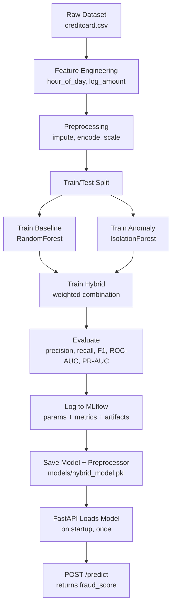

# Fraud Detection MLOps — A Learning-First README

> This is the README we wish existed when we first opened this repo. It's written for the version of you who clones this in six months and has forgotten everything — and for anyone learning MLOps who wants to understand *why*, not just *what to type*.

---

## Table of Contents
1. [Project Overview](#1-project-overview)
2. [Repository Architecture](#2-repository-architecture)
3. [End-to-End Pipeline](#3-end-to-end-pipeline)
4. [Technology Stack](#4-technology-stack)
5. [Installation Guide](#5-installation-guide)
6. [Running the Project](#6-running-the-project)
7. [API Guide](#7-api-guide)
8. [MLflow Guide](#8-mlflow-guide)
9. [Understanding the Project](#9-understanding-the-project)
10. [Engineering Decisions](#10-engineering-decisions)
11. [Common Errors and Debugging](#11-common-errors-and-debugging)
12. [Interview Questions](#12-interview-questions)
13. [Learning Roadmap](#13-learning-roadmap)
14. [Future Improvements](#14-future-improvements)

---

## 1. Project Overview

### What problem does this solve?
Given a credit card transaction, predict whether it's fraudulent. The dataset is the well-known [Kaggle Credit Card Fraud dataset](https://www.kaggle.com/mlg-ulb/creditcardfraud): 284,807 transactions, only 492 of them fraud (0.17%).

### Why is fraud detection hard?
Not because the ML is exotic — because the data is brutally imbalanced. If a model predicted "not fraud" on every single transaction, it would be **99.8% accurate** and completely useless. This one fact drives almost every design decision in this repo: which metric to optimize (not accuracy), how to handle resampling (carefully, and only in the right place), and why a single model isn't enough.

### Why a hybrid model?
Two different modeling philosophies each catch different things:
- A **supervised model** (RandomForest) learns "what does fraud look like, based on past labeled examples." Strong when fraud patterns repeat.
- An **anomaly detection model** (Isolation Forest) learns "what does normal look like," and flags anything that deviates — without ever seeing a fraud label. Strong at catching *novel* fraud patterns the supervised model has never seen labeled examples of.

Combining them (weighted average of both scores) catches more real fraud cases with fewer false alarms than either alone. On this project's actual test set, the hybrid model cut false positives by ~45% compared to the supervised baseline alone, while keeping recall nearly the same. That's not a hypothetical — it's measured, and reproducible by running the pipeline yourself.

### What makes this different from a Kaggle notebook?
A notebook that trains a model and prints an AUC score answers the question "can this data be modeled." This repo answers a different, harder question: "can this model be *operated*." That means:
- Can someone else run this exact pipeline and get the exact same preprocessing? (Yes — the fitted preprocessor is saved as one object, not re-fit ad hoc.)
- Can this model be queried by another program, not just a notebook cell? (Yes — FastAPI.)
- Can you tell, six months from now, whether this model still behaves the way it did on day one? (Yes — MLflow tracks every run, and drift detection compares live data against the training distribution.)
- Is there proof this actually works, or just an assumption? (25 automated tests, including regression tests for real bugs found during development — see [Section 11](#11-common-errors-and-debugging).)

---

## 2. Repository Architecture

```text
fraud-detection-mlops/
├── configs/
│   └── config.yaml              # every tunable setting: paths, model params, API/monitoring config
├── data/
│   ├── raw/                     # original dataset (DVC-tracked, not committed to git)
│   └── processed/               # a reference snapshot of the processed data (regenerable)
├── notebooks/
│   └── eda_creditcard.ipynb     # exploratory analysis: class balance, distributions, correlations
├── src/
│   ├── preprocessing/
│   │   ├── ingestion.py         # loads the raw CSV
│   │   ├── feature_engineering.py  # derives new features (hour of day, log-amount)
│   │   └── preprocess.py        # imputes, encodes, scales — and SAVES the fitted transform
│   ├── models/
│   │   ├── baseline.py          # RandomForest, the supervised model
│   │   ├── anomaly.py           # IsolationForest, the unsupervised model
│   │   └── hybrid.py            # combines both into one loadable model object
│   ├── api/
│   │   ├── app.py               # FastAPI app — how the model gets used outside a notebook
│   │   └── schemas.py           # defines exactly what a valid request/response looks like
│   ├── monitoring/
│   │   ├── drift_detection.py   # is incoming data still similar to training data?
│   │   ├── basic_metrics.py     # is the model still performing well on new labeled data?
│   │   └── logger.py            # writes monitoring events to a persistent file
│   ├── evaluation.py            # shared metrics used by every model (precision, recall, F1, AUCs)
│   ├── train_pipeline.py        # the conductor — runs every stage above in order
│   └── utils.py                 # config loading, logging, path resolution
├── tests/                       # 25 tests — the proof that the above actually works
├── scripts/                     # thin convenience wrappers around the python commands
└── .github/workflows/ci.yml     # runs lint + tests automatically on every push
```

### Why does each folder exist?

**`configs/`** exists so that changing a hyperparameter, a file path, or an API port never means editing Python code. This matters more than it sounds: config-in-code means every change is a code change, needs a code review, and risks introducing a typo into logic. Config-in-YAML means a non-engineer (or a script) can change behavior safely.

**`src/preprocessing/`** is split into three single-purpose files instead of one big `prep.py` because each step has a different lifecycle. Ingestion runs once per pipeline run. Feature engineering is pure logic with no learned state. Preprocessing (`preprocess.py`) *learns* something (the scaler's mean/variance, the imputer's fill values) — and anything that learns state needs to be saved and reused identically later. Separating them makes that distinction visible in the file structure itself.

**`src/models/`** holds three files, not one, because baseline/anomaly/hybrid are genuinely three different objects with different training procedures — cramming them into one file would hide that they're independently swappable.

**`src/api/`** is separate from `src/models/` because serving concerns (request validation, HTTP status codes, JSON schemas) have nothing to do with modeling concerns. A model shouldn't need to know what FastAPI is.

**`src/monitoring/`** exists because training a good model once is the easy 20%. The hard 80% is knowing whether it's *still* good a month later, once real-world data has started to drift from what it was trained on.

**`tests/`** isn't a formality here — during development, tests caught two real bugs (see [Section 11](#11-common-errors-and-debugging)) that would otherwise have shipped silently.

---

## 3. End-to-End Pipeline



### What happens at each stage

**Feature Engineering** happens on *raw* values, before scaling. This matters: deriving "hour of day" from a `Time` column that's already been standardized would produce nonsense (standardized values aren't seconds anymore). This was actually a real bug caught during development — see [Section 11](#11-common-errors-and-debugging).

**Preprocessing** fits an imputer, an encoder, and a scaler on the training data, then **saves that fitted object**. This is the single most important design decision in the whole repo — see [Section 9](#9-understanding-the-project) for why.

**Train/Test Split** happens *before* any class-imbalance handling. Order matters a lot here — see [Section 10](#10-engineering-decisions).

**Training** happens three times: once for the baseline, once for the anomaly model, once for the hybrid (which internally trains both again with the hybrid's own weighting logic).

**Evaluation** uses precision, recall, F1, ROC-AUC, and PR-AUC — deliberately not accuracy, for the imbalance reason explained in [Section 1](#1-project-overview).

**MLflow** logs every run: what hyperparameters were used, what the resulting metrics were, and a copy of the model itself. This turns "I think this run was better" into "here's the exact number, and here's the exact model that produced it."

**Saved artifacts** (`models/hybrid_model.pkl`, `models/preprocessor.pkl`) are what the API actually loads. Nothing about serving re-trains or re-fits anything.

**FastAPI** loads the model **once**, when the server starts — not on every request. Loading a model from disk takes real time; doing it per-request would make the API unusably slow.

---

## 4. Technology Stack

| Technology | Role | Why this, not an alternative |
|---|---|---|
| **Python** | Everything | The default for ML — the ecosystem (scikit-learn, pandas) is unmatched |
| **scikit-learn** | RandomForest, IsolationForest, preprocessing | Battle-tested, simple API, good enough for tabular data like this |
| **imbalanced-learn (SMOTE)** | Synthetic oversampling of the minority (fraud) class | Plain class-weighting alone often isn't enough when the imbalance is this extreme (1:580) |
| **pandas / numpy** | Data manipulation | Standard for tabular data in Python |
| **FastAPI** | Serving the model over HTTP | Async-native, automatic request validation via Pydantic, automatic interactive docs (Swagger) for free |
| **MLflow** | Experiment tracking | Answers "which run produced this model, with what settings, and what were the metrics" without a spreadsheet |
| **Joblib** | Saving/loading Python objects (models, the preprocessor) | The standard for scikit-learn objects — handles numpy arrays inside objects more efficiently than plain pickle |
| **YAML (configs/config.yaml)** | All tunable settings | Human-readable, no code changes needed to tune the system |
| **DVC** | Versioning the dataset itself | Git isn't built for 150MB CSV files — DVC tracks data the way git tracks code, without bloating the git repo. **Optional in this repo**: nothing in `src/` requires DVC to run; it's there for reproducibility discipline (see [Section 11](#11-common-errors-and-debugging) on when you can ignore it) |
| **scipy (KS-test)** | Drift detection | Kolmogorov-Smirnov test is a standard, simple way to check if two samples come from different distributions |
| **pytest** | Testing | The standard Python testing framework |
| **ruff** | Linting | Fast, catches real errors (unused imports, undefined names) without excessive style nitpicking |

---

## 5. Installation Guide

```bash
git clone <your-repo-url>
cd fraud-detection-mlops

# Create and activate a virtual environment
python -m venv .venv
# Windows:
.venv\Scripts\activate
# macOS/Linux:
source .venv/bin/activate

# Install dependencies
pip install -r requirements.txt
```

**Known dependency issues** (real ones encountered building/running this repo — see [Section 11](#11-common-errors-and-debugging) for full detail and fixes):
- A bad version pin (`dvc==3.5.3`, a version that was never published) will make `pip install` fail outright. Use a range like `dvc>=3.50,<4.0` instead.
- `xgboost` and `lightgbm` may have been listed in an earlier version of `requirements.txt` but nothing in this codebase imports them — if you see platform-compatibility errors for either, they're safe to drop entirely.

---

## 6. Running the Project

### Train everything
```bash
# macOS/Linux/WSL:
bash scripts/run_training.sh

# Windows PowerShell (the .sh script won't run natively — call Python directly):
$env:PYTHONPATH = "."
python -m src.train_pipeline
```

**What this command actually does, in order:**
1. Loads `configs/config.yaml`
2. Loads `data/raw/creditcard.csv`
3. Engineers features (`hour_of_day`, `log_amount`) on the raw values
4. Fits and applies preprocessing (impute → encode → scale), and **saves** the fitted preprocessor
5. Splits into train/test (stratified, so the tiny fraud class is represented in both)
6. Trains the baseline RandomForest (applying SMOTE to the training split only)
7. Trains the IsolationForest anomaly model
8. Trains the hybrid model (combines both)
9. Evaluates all three on the *untouched* test set
10. Logs parameters, metrics, and model artifacts to MLflow for each of the three runs
11. Saves the hybrid model, the preprocessor, the feature column list, and a reference data sample to `models/`

Expect this to take several minutes — training happens on the full 284,807-row dataset, not a sample.

### Serve the model
```bash
$env:PYTHONPATH = "."
uvicorn src.api.app:app --host 0.0.0.0 --port 8000
```
Requires step above to have completed at least once (the API loads `models/hybrid_model.pkl`, which doesn't exist until training has run).

### Check for data drift / evaluate a labeled batch
```bash
$env:PYTHONPATH = "."
python -m src.monitoring.drift_detection
python -m src.monitoring.basic_metrics path\to\labeled_batch.csv
```

### Run the tests
```bash
$env:PYTHONPATH = "."
pytest tests/ -v
```

---

## 7. API Guide

### Why does an API exist at all?
Because a `.pkl` file sitting on disk is only usable by whoever has direct file access to that machine, in that language, with that exact library versions installed. An API turns the model into something *any* program, in *any* language, on *any* machine, can use — by sending a request over the network and getting a JSON response back. This is the actual difference between "I trained a model" and "I deployed a model."

### Why not just load the `.pkl` file directly wherever it's needed?
Because that couples every consumer of the model to: Python, the exact scikit-learn version used to train it, the exact file path, and the exact preprocessing code. If the model needs retraining, every consumer needs to reload it — versus, with an API, you restart one service and every consumer is instantly using the new model.

### Endpoints

**`GET /health`**
Returns whether the API is up and whether a model is currently loaded. Useful for orchestration systems (like Kubernetes) to know whether this instance is ready to receive traffic.

**`POST /predict`**
Takes a transaction (JSON body) and returns:
```json
{
  "fraud_score": 0.087,
  "is_fraud": false,
  "threshold_used": 0.5
}
```
`fraud_score` is the hybrid model's combined score (0 to 1). `is_fraud` is that score thresholded at 0.5.

### Swagger UI
FastAPI automatically generates an interactive docs page at `http://localhost:8000/docs`. This is **Swagger**, and it's worth being precise about what it is: it's a *testing interface*, generated from the code, for humans to manually try endpoints in a browser. It is not part of the prediction pipeline, not something a production client would use to make real predictions (real clients call the API directly with HTTP requests), and not something the API depends on. You could delete FastAPI's auto-docs feature entirely and `/predict` would work exactly the same.

---

## 8. MLflow Guide

### What's an experiment? What's a run?
An **experiment** is a named collection of related training attempts — this repo uses one experiment, `fraud-detection`. A **run** is a single training attempt within that experiment — one execution of, say, training the baseline model with a specific set of hyperparameters. Every time you execute `train_pipeline.py`, three new runs get logged: one each for baseline, anomaly, and hybrid.

### What gets tracked per run?
- **Params**: the hyperparameters used (e.g. `n_estimators`, `max_depth`, `contamination`)
- **Metrics**: the resulting numbers (precision, recall, F1, ROC-AUC, PR-AUC)
- **Artifacts**: the actual trained model object, saved alongside the run

### Viewing the UI
```bash
$env:PYTHONPATH = "."
mlflow ui --backend-store-uri sqlite:///experiments/mlflow.db
```
Then open `http://localhost:5000`. You'll see the `fraud-detection` experiment, and inside it, a table of runs — sortable by any metric, so you can directly compare "did increasing `n_estimators` actually help?" across runs instead of scrolling through log files.

---

## 9. Understanding the Project

**Why save the preprocessor, not just the model?**
Because a trained model expects input in a very specific numeric shape — scaled the same way, encoded the same way, missing values filled the same way as during training. If the API refit a new scaler on whatever data it happened to receive, the resulting numbers would be scaled *differently* than what the model learned on, and predictions would be silently wrong — no error, just bad numbers. Saving the *fitted* preprocessor and reusing it guarantees the exact same transformation every time.

**Why `transform()` instead of `fit_transform()` at inference time?**
`fit_transform()` learns new statistics (mean, variance, fill values) from whatever data you give it. At inference time, you're looking at *one transaction* — fitting a scaler on a single data point is meaningless (its "mean" and "standard deviation" would just be the value itself and zero). `transform()` applies statistics that were already learned from the full training set, which is what you actually want.

**Why does feature engineering happen during inference too, not just training?**
Because the model was trained on data that *included* `hour_of_day` and `log_amount` as features — if a live transaction arrives without those derived columns, the model literally cannot make a prediction; it expects a fixed set of input columns. Feature engineering isn't a one-time training step, it's part of the permanent input contract of the model.

**Why is the model loaded only once, at API startup?**
Loading a ~12MB model object from disk isn't instant. Doing it inside the `/predict` function would mean every single request pays that disk-read cost — turning a millisecond-scale prediction into a much slower one, for no benefit (the model doesn't change between requests). Loading once at startup and keeping it in memory is the standard pattern for serving any ML model.

**Why is configuration stored in YAML instead of hardcoded in Python?**
Because changing a hyperparameter shouldn't require touching (and re-reviewing, and re-testing) Python code. `configs/config.yaml` is the single place every tunable value lives — dataset paths, preprocessing options, model hyperparameters, API settings, monitoring thresholds.

**Why are hybrid models useful?**
Because supervised and unsupervised models make different kinds of mistakes. A supervised model is only as good as the labeled examples it saw — it can miss genuinely novel fraud patterns. An anomaly detector doesn't need labels at all, but on its own it's much less precise (in this repo's actual results, IsolationForest alone scores an F1 of ~0.30 versus the hybrid's ~0.76). Combining scores lets the strengths of one offset the weaknesses of the other.

---

## 10. Engineering Decisions

**Why FastAPI over Flask?**
FastAPI validates incoming requests automatically using Pydantic type hints (a malformed request gets rejected with a clear 422 error before your code even runs), and generates interactive API docs for free. Flask can do all of this too, but requires more manual wiring. For a project centered on serving a strict input schema (numeric transaction features), automatic validation is a direct fit.

**Why Joblib over pickle?**
Joblib is optimized for objects containing large numpy arrays — which is exactly what a fitted scikit-learn model or preprocessor is. It's faster and produces smaller files for this kind of object than plain `pickle`.

**Why hybrid scoring (weighted average) instead of stacking or a meta-model?**
Simplicity and interpretability. A weighted average of two scores is easy to reason about, easy to tune (one weight), and easy to explain to a non-technical stakeholder ("we trust the supervised model 60%, the anomaly model 40%"). A stacked meta-model (training a third model on top of the first two's outputs) could plausibly perform better, but adds another layer of complexity and another thing that can silently drift or overfit — a real tradeoff, not a strictly better option.

**Why is preprocessing separated from model training?**
Because they have different failure modes and different lifecycles. Preprocessing bugs (wrong scaling, wrong encoding) corrupt every downstream model silently. Keeping it in its own module, with its own tests, makes it independently verifiable — the tests in `test_preprocessing.py` don't need to train a single model to catch a scaling bug.

**Why config-driven architecture, and what's the tradeoff?**
The upside: swapping a hyperparameter or a dataset path requires zero code changes. The downside: config-driven systems can hide behavior — someone reading `train_pipeline.py` doesn't see the actual RandomForest depth without also opening `config.yaml`. This repo accepts that tradeoff because the alternative (hardcoded values scattered across files) is worse for a project meant to be re-run with different settings.

---

## 11. Common Errors and Debugging

These are real issues hit while building and running this exact repository — not hypothetical ones.

### 1. Bash `.sh` scripts don't run on native Windows PowerShell
**Symptom:** `bash scripts/run_training.sh` fails with something like `Windows Subsystem for Linux has no installed distributions.`
**Why it happens:** the `scripts/*.sh` files are bash scripts. PowerShell doesn't natively interpret bash syntax, and `bash` on Windows routes through WSL, which may not be installed.
**Fix:** don't use the `.sh` wrapper on Windows — run the underlying Python command directly instead:
```powershell
$env:PYTHONPATH = "."
python -m src.train_pipeline
```
Every script in `scripts/` is a thin wrapper; you can always read the `.sh` file to see the two or three real commands inside it and run those directly.

### 2. `pkg_resources` ModuleNotFoundError / MLflow fails to import
**Symptom:** MLflow (or something it depends on) fails with `ModuleNotFoundError: No module named 'pkg_resources'`, even though `setuptools` shows as installed.
**Why it happens:** newer `setuptools` versions can end up in a state where `pkg_resources` (a submodule some older packages still depend on) isn't properly exposed — often from an interrupted or partial install.
**How to diagnose:**
```powershell
python -c "import importlib.util; print(importlib.util.find_spec('pkg_resources'))"
```
If this prints `None`, that's the problem.
**Fix:**
```powershell
python -m pip install --upgrade --force-reinstall setuptools
```

### 3. `pip install -r requirements.txt` fails on a specific package version
**Symptom:** `ERROR: Could not find a version that satisfies the requirement dvc==3.5.3` (or similar), with a long list of *other* versions that do exist.
**Why it happens:** a version pin in `requirements.txt` that was never actually published to PyPI — easy to introduce by typo or by copying a version number from the wrong place.
**Fix:** loosen the pin to a range that's actually available, e.g. `dvc>=3.50,<4.0`, or check PyPI directly for a version that exists.

### 4. `dvc pull` fails with "not inside of a DVC repository"
**Symptom:** running `dvc pull` errors with `you are not inside of a DVC repository`.
**Why it happens:** DVC tracking files (`.dvc` files) can exist in a repo without `dvc init` ever having been run, and without a DVC *remote* (like S3 or Google Drive) ever being configured. `dvc pull` needs both of those to fetch data from somewhere.
**When you can just ignore this:** if the actual data file (e.g. `data/raw/creditcard.csv`) is already sitting on your disk at the right path, you don't need `dvc pull` at all — it's a mechanism for *fetching* data you don't have yet, not a requirement for running the pipeline. Training will work fine without ever touching DVC.
**If you do want it working properly:** run `dvc init`, then `dvc remote add <name> <remote-url>` pointing at real storage (S3, Google Drive, etc.), then `dvc push` to actually populate that remote.

### 5. Unused dependencies causing install failures
**Symptom:** an error about a package (e.g. `xgboost`) being "not supported on this platform," even though the code never imports it.
**Why it happens:** a `requirements.txt` that was never cross-checked against actual `import` statements in the codebase — carrying forward dependencies from an earlier version of the project that no longer uses them.
**Fix:** grep the codebase for the import before assuming a dependency is needed:
```powershell
Select-String -Path src\*.py,src\**\*.py -Pattern "import xgboost"
```
If nothing matches, it's safe to remove from `requirements.txt`.

### 6. Swagger UI shows fewer fields than expected on `/predict`
**Symptom:** the interactive docs at `/docs` only show `Time` and `Amount` as fields, even though the model expects 30+ features.
**Why it happens:** the request schema (`Transaction` in `schemas.py`) explicitly declares `Time` and `Amount` as required fields, and uses `ConfigDict(extra="allow")` to accept any *additional* fields beyond those — Swagger only renders what's explicitly declared, not what's dynamically allowed.
**Why it's built this way:** this keeps the demo schema simple while still letting the API accept the full real feature set (`V1`-`V28`) if you send them. Inside `transform()`, any expected column that's genuinely missing from the request gets filled with a neutral value (0) rather than crashing — a pragmatic choice for a demo API.
**The honest limitation:** filling missing features with 0 is a reasonable fallback for demonstration purposes, but it's not how a real production system would work — a real system would sit behind a dedicated feature service that always supplies the complete, correct feature set for a transaction, rather than silently defaulting missing ones.

---

## 12. Interview Questions

Use these to test your own understanding of this repo before an interview — not just recall the answer, but be able to point to the actual line of code that demonstrates it.

**Preprocessing & Data**
- Why do we save the fitted preprocessor instead of re-fitting it each time?
- What's the difference between `fit_transform()` and `transform()`, and when should each be used?
- What is data leakage, and where in this pipeline could it have happened if built carelessly? *(Hint: SMOTE before the train/test split.)*
- Why is SMOTE applied only to the training split, never to test data or to the anomaly model's input?

**Modeling**
- Why use Isolation Forest for anomaly detection instead of another supervised model?
- What's the practical difference between training a model in a supervised way versus an unsupervised way?
- Why does accuracy fail as a metric here, and what should be used instead?
- What's the difference between precision and recall, and why might you weight one over the other for fraud detection specifically?
- What would happen if you evaluated the anomaly model's threshold using the training set instead of a held-out set?

**Serving & MLOps**
- Why use FastAPI instead of loading a `.pkl` file directly in a script?
- Why is the model loaded once at startup instead of on every request?
- What are the advantages of MLflow over just writing metrics to a text file?
- What's the difference between training and inference, in terms of what state each one needs?
- Why is configuration stored in YAML instead of hardcoded in Python?

**Monitoring**
- What is data drift, and how does the KS-test detect it?
- What's the difference between data drift and concept drift?
- Why might a model's live performance degrade even if its code hasn't changed at all?

---

## 13. Learning Roadmap

If you're studying this repo to actually learn from it (not just run it), this order builds understanding progressively:

1. **Read this README's architecture section** — get the map before exploring the territory.
2. **Run training** (`python -m src.train_pipeline`) and watch the log output — see each pipeline stage actually execute.
3. **Explore the MLflow UI** — compare the three runs (baseline/anomaly/hybrid) side by side.
4. **Run the API** and hit `/docs` in a browser — send a real prediction request.
5. **Study `src/preprocessing/preprocess.py`** — this is the file with the most subtle, most important design decision in the repo (see [Section 9](#9-understanding-the-project)).
6. **Study `src/models/hybrid.py`** — see how two independently-trained models get combined into one loadable object.
7. **Study `src/monitoring/`** — understand drift detection as a concept, separate from model training entirely.
8. **Read `tests/`** — tests are often the clearest documentation of *intended* behavior; read them alongside the code they test.
9. **Read [Section 11](#11-common-errors-and-debugging)** again, now that you understand the code — the errors will make more sense in context.

---

## 14. Future Improvements

- **Docker** — containerize the API for consistent deployment across environments
- **Cloud deployment** — deploy the containerized API to a cloud platform (AWS/GCP/Azure)
- **Model registry** — use MLflow's Model Registry for staged rollout (dev → staging → production) instead of manually copying `.pkl` files
- **Feature store** — replace the "fill missing features with 0" fallback with a real feature-serving layer
- **Authentication** — the `/predict` endpoint currently has none; a production API would need it
- **Monitoring dashboards** — visualize drift and performance metrics over time instead of reading JSON log files
- **Batch inference** — add an endpoint or script for scoring many transactions at once, not just one per request
- **CI/CD deployment step** — extend the existing CI (lint + test) to also deploy on a successful merge to main